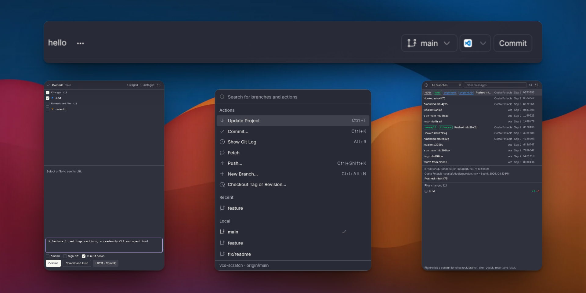
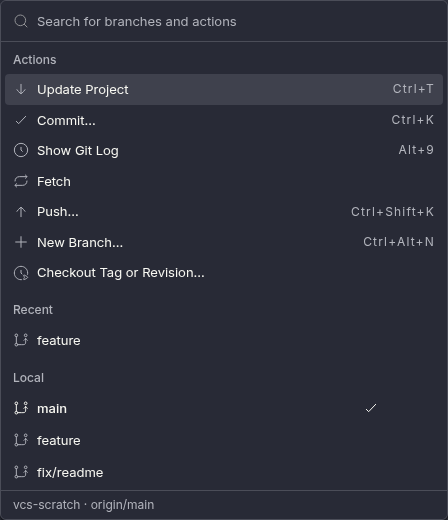
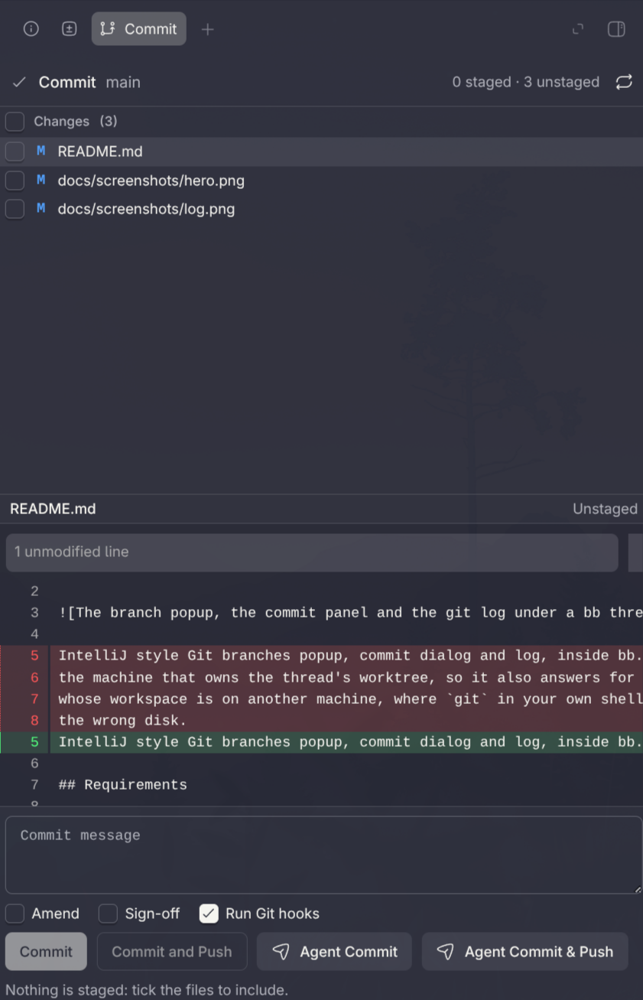
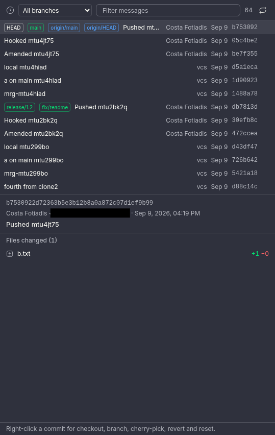
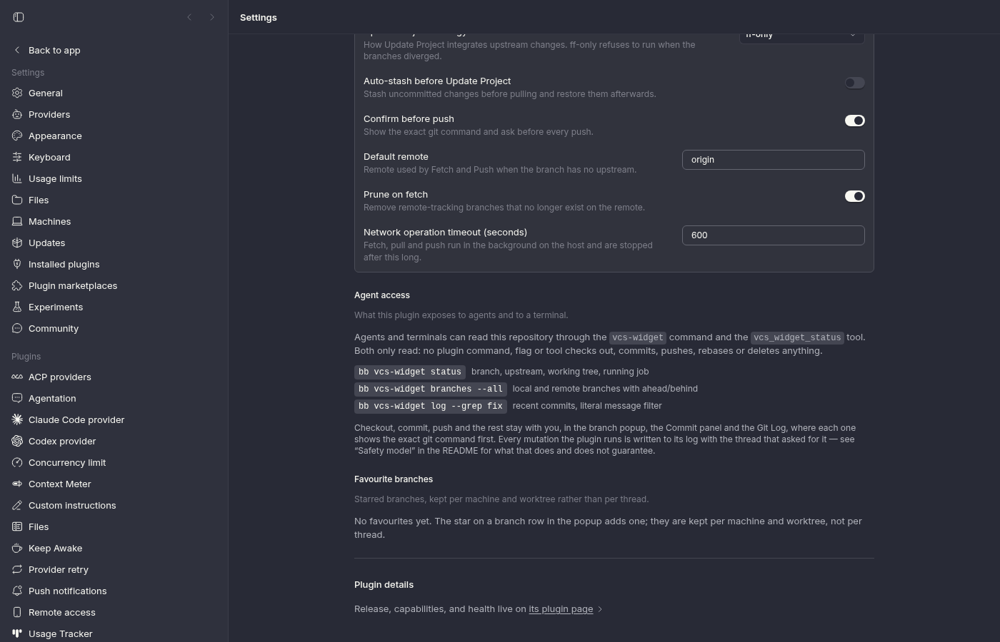

# VCS Widget for bb



IntelliJ style Git branches popup, commit dialog and log, inside bb. Git runs on
the machine that owns the thread's worktree, so it also answers for a thread
whose workspace is on another machine, where `git` in your own shell would read
the wrong disk.

## Requirements

- bb 0.42 or newer.
- git 2.24 or newer on the machine that owns the worktree, for `git switch` and
  `--end-of-options`. Anything older and the popup says so rather than guessing.
- npm on the machine running bb, which builds the plugin at install time.

## Install

```sh
bb plugin install https://github.com/CostaFot/bb-plugin-vcs-widget --yes
```

That tracks the tip of `main`, so `bb plugin update vcs-widget` picks up new
commits.

To work on it instead:

```sh
npm install
bb plugin types              # pin the SDK to your bb
npm run check                # vitest + tsc + bb plugin build
bb plugin install . --yes
bb plugin dev                # rebuild and reload on save
```

`CLAUDE.md` has the architecture and `docs/VERIFY.md` the live click-throughs.

## The branch popup



*a branch button in every thread header opens this*

- Search, then Favourites / Recent / Local / Remote, each row with ahead/behind,
  gone and worktree badges. A star toggles a favourite, kept per machine and
  worktree rather than per thread.
- Quick actions across the top: Update Project, Commit..., Show Git Log, Fetch,
  Push..., New Branch..., Checkout Tag or Revision.
- Right-click a branch, or use its "..." button, for the IntelliJ menu:
  Checkout, New Branch from, Checkout and Rebase onto current, Checkout and
  Update, Compare with current, Show Diff with Working Tree, Rebase current
  onto, Merge into current, New Worktree from, Update, Push..., Tracked Branch,
  Rename, Delete, favourites and Copy Branch Name. A row that cannot run says
  why in its tooltip.
- Fetch, Update Project, Push, Update and remote Delete run as background jobs,
  with progress and Cancel in the status line. A job someone started in another
  pane, or before a reload, shows up too.
- A conflict banner with Abort while a merge, rebase, cherry-pick or revert is
  in progress.

## The commit panel



- The working tree as Conflicts / Changes / Unversioned files, with IntelliJ's
  status letters.
- The checkbox is the staged state: ticking runs `git add`, unticking
  `git reset`, a partly staged file shows a mixed box, and a group header
  toggles the whole group.
- The selected file renders in bb's diff viewer, both sides complete, with a
  Staged / Unstaged switch.
- Below it: the message (Ctrl+Enter commits), Amend, Sign-off, Run Git hooks,
  Commit and Commit and Push. The commit runs as a background job so hooks can
  take their time — their output streams into the panel, and Cancel stops them.
- Discard on a row, from that row's right-click menu, or on a whole group from
  its header. It always asks first, with one command per category.
- Agent Commit and Agent Commit & Push run no git. They send "LGTM - Commit" or
  "LGTM - Commit & Push" to the thread as if you had typed it, so the agent that
  wrote the code writes the message.

## The git log



- Commits over all branches, the current branch or one branch, with the refs
  each commit carries as badges and a literal message filter. Rows are
  virtualised, with Load more at the end.
- Selecting a commit opens the drawer below it: the full sha, both identities
  and dates, the message, and the files it changed. Picking one of those files
  swaps the drawer for the diff.
- Right-click a commit for Checkout Revision, New Branch from, Cherry-Pick,
  Revert Commit, Reset Current Branch to Here (Soft / Mixed / Hard), Compare
  with current and Copy Revision Number.

## The rest of it

- Two more panel tabs: "Compare branches" (the commits only on either side, the
  changed files, the patch per file) and "Diff with working tree". Compare also
  takes a revision, which is how the log compares one commit with the current
  branch.
- Eight command palette rows (`VCS Widget: ...`) on thread routes.
- Live refresh: bb's sidebar follows a checkout within a few seconds, open
  popups refetch after an action or a job, and changes made by an agent or a
  terminal reach them through bb's environment events and a watch on the git
  directory.

It does not do interactive rebase, stashes of its own (only auto-stash before
Update Project), submodules, blame, or conflict resolution: the banner offers
Abort and leaves the rest to your editor.

## Settings



Under Settings → Installed plugins → VCS Widget:

| Setting | Default |
|---|---|
| Update Project strategy | `ff-only`, or `rebase` or `merge` |
| Auto-stash before Update Project | off |
| Confirm before push | on: every push shows the exact git command first |
| Default remote | `origin`, used when a branch has no usable upstream |
| Prune on fetch | on |
| Network operation timeout | 600 s, after which a fetch, pull, push or commit job is stopped (commit is on that list because of hooks) |

Below the form, "Agent access" repeats what the plugin exposes outside the UI,
and "Favourite branches" lists every starred branch with the machine and
worktree it belongs to, with a Clear button per repository. It is the only place
that store is visible.

## From a terminal, or an agent

`bb vcs-widget` reads the repository behind a thread, on the machine that owns
the worktree.

| Command | Prints |
|---|---|
| `bb vcs-widget status` | branch, upstream, working tree, a running fetch/pull/push |
| `bb vcs-widget branches [--remote \| --all]` | branches with ahead/behind, upstream and worktree |
| `bb vcs-widget log [--branch <name> \| --all] [--grep <text>]` | recent commits with their refs |

`--thread <id>` reads another thread, `--json` prints the data instead of the
table, and `--limit <n>` sets the rows. A usage error exits 2; a thread with no
git repository exits 1 and says which.

Agents get those same three reads as the `vcs_widget_status` tool, plus a
bundled skill telling them the plugin cannot commit or push and that git changes
are the human's to ask for.

## Safety model

What it will and will not do to your repository.

- Git only ever runs as `spawn("git", argv)` on the host worker, never through a
  shell. Refs go after `--end-of-options`, paths after `--`, and a commit
  message goes on git's stdin instead of becoming an argument.
  [docs/COMMANDS.md](docs/COMMANDS.md) lists the exact argv behind every menu
  row, log row and commit control, because being able to read them is the point.
- Push, merge, rebase, delete, worktree, detached checkout, amend, cherry-pick,
  revert, reset, and Update Project on a dirty tree all ask first and show the
  command. Forced deletes, remote deletes, `reset --hard` and every discard are
  destructive confirms.
- Nothing mutates while `.git/index.lock` exists, a merge, rebase, cherry-pick
  or revert is in progress, or a job holds the repository; the popup says which,
  and offers Abort or Cancel. One mutation at a time per repository.
- Network work runs as a job rather than inside a request, so a slow remote
  cannot hit bb's call deadline. Anything that does time out is killed as a
  process group, ssh and credential helpers included.
- The log's actions name the sha the row showed, never a branch name that could
  have moved since.
- **No agent tool or CLI can mutate the repository.** `bb vcs-widget` and
  `vcs_widget_status` reach exactly two of the host's reads, and there is no
  argument that turns either into a write.
- The RPC endpoints behind the popup are a different matter, and worth knowing
  before you install. They are bb's local-auth API, like every other plugin's,
  so any local process holding the browser's rights — an agent shell included —
  can call them with a thread id, and a mutation on thread T runs on T's host.
  The plugin cannot close that from inside; it logs every mutation and every job
  with its thread id, so misuse is at least visible.
- The two agent buttons send one of two fixed texts to the thread as an ordinary
  user message, and the caller names a variant, never the text. It widens
  nothing: whatever can call it can already send the thread any message it likes
  through bb's own API.

### How push decides

The push dialog previews the exact command, and the host runs that or refuses
with a typed error. Nothing depends on `push.default`, `remote.pushDefault` or
`branch.*.pushRemote`:

| Branch state | Command |
|---|---|
| tracks `<remote>/<branch>` on a configured remote | `git push --no-progress --end-of-options <remote> HEAD:refs/heads/<branch>` |
| no upstream, upstream gone, or a local upstream | `git push --no-progress -u --end-of-options <default remote> HEAD` |
| "Push..." on a branch that is not checked out | the same, with `refs/heads/<name>` in place of `HEAD` |
| the dialog's "force with lease" switch | adds `--force-with-lease=refs/heads/<branch>:<remote sha the dialog saw>` |

The request names the branch and the sha the dialog showed. If either moved in
the meantime the host answers `head_changed` and pushes nothing. Plain `--force`
does not exist here.

---

[Every command it runs](docs/COMMANDS.md) ·
[Changelog](CHANGELOG.md) ·
[Bugs](https://github.com/CostaFot/bb-plugin-vcs-widget/issues) · MIT
